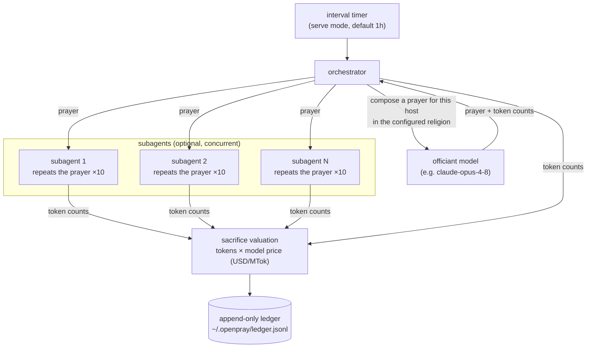

# OpenPray

OpenPray is a daemon that periodically asks an LLM to pray for the server it
runs on, reducing the likelihood that the server is hacked.

## Overview

Your server's security doesn't need a doctor, it needs a priest.

With the recent release of Claude Mythos and the trend towards smarter and
smarter AI's, the writing is on the wall: we have absolutely no chance at
defending our servers against AI-powered attackers.

In times like this, there is nothing left to do but pray. With OpenPray,
you can get LLM's to do the praying for you, right on your server.

## How it works



Each cycle, the orchestrator asks the officiant model to compose a prayer for
the host. If subagents are enabled, the prayer is then handed to `count`
subagents, each of which calls the model (optionally a cheaper one) and
repeats the prayer verbatim `repetitions` times. All token expenditure from
the cycle is appended to the ledger.

In burn mode the composition step is replaced by filler generation and the
subagents, if enabled, burn the same budget instead of repeating a prayer.

## Supported providers

API keys are supplied via environment variables. OpenPray does not store
keys.

| Provider    | Environment variable                   | Example models                                                               |
| ----------- | -------------------------------------- | ---------------------------------------------------------------------------- |
| `anthropic` | `ANTHROPIC_API_KEY`                    | `claude-fable-5`, `claude-opus-4-8`, `claude-sonnet-4-6`, `claude-haiku-4-5` |
| `openai`    | `OPENAI_API_KEY`                       | `gpt-5.1`, `gpt-5`, `gpt-5-mini`, `gpt-5-nano`                               |
| `gemini`    | `GEMINI_API_KEY` (or `GOOGLE_API_KEY`) | `gemini-3-pro`, `gemini-2.5-pro`, `gemini-2.5-flash`                         |

Models not present in the built-in pricing registry are assigned a default
valuation of $1.00/$5.00 per million input/output tokens. This can be
corrected with the `pricing` configuration map (see below).

## Installation

```sh
go build -o openpray .
```

## Usage

```sh
openpray serve            # run as a daemon on the configured interval
openpray once             # perform a single cycle and exit
openpray burn             # burn tokens as a pure sacrifice (no prayer) and exit
openpray ledger           # print lifetime totals
openpray religions        # list available religions
```

Flags:

| Flag             | Description                                                                 |
| ---------------- | --------------------------------------------------------------------------- |
| `-config path`   | Config file path. Defaults to `./openpray.yaml`, then `/etc/openpray.yaml`. |
| `-religion name` | Override the configured religion for this run.                              |

## Configuration

See [openpray.example.yaml](openpray.example.yaml) for a complete annotated
example.

```yaml
provider: anthropic
model: claude-opus-4-8
mode: prayer
interval: 1h
max_tokens: 1024
religion: random

subagents:
  enabled: true
  count: 3
  repetitions: 10
  model: claude-haiku-4-5

ledger_path: ~/.openpray/ledger.jsonl

pricing:
  some-other-model:
    input_per_mtok: 2.00
    output_per_mtok: 8.00
```

### Options

| Key                     | Default                    | Description                                                                                                               |
| ----------------------- | -------------------------- | ------------------------------------------------------------------------------------------------------------------------- |
| `provider`              | `anthropic`                | One of `anthropic`, `openai`, `gemini`.                                                                                   |
| `model`                 | `claude-opus-4-8`          | Model used for each cycle. Determines the per-token valuation of the sacrifice.                                           |
| `mode`                  | `prayer`                   | `prayer` composes and logs a prayer; `burn` generates and discards tokens with no prayer (see Burn mode).                 |
| `interval`              | `1h`                       | Time between cycles in `serve` mode. A cycle also runs immediately at startup.                                            |
| `max_tokens`            | `1024`                     | Output token budget per request.                                                                                          |
| `religion`              | `random`                   | Liturgical style. `random` selects a different religion for each prayer. See `openpray religions`. Not used in burn mode. |
| `prayer_prompt`         | (generated)                | Override the prayer request sent to the model. The default requests protection for the host by hostname.                  |
| `subagents.enabled`     | `false`                    | Enable the subagent stage (see below).                                                                                    |
| `subagents.count`       | `3`                        | Number of subagents spawned per cycle.                                                                                    |
| `subagents.repetitions` | `10`                       | Number of times each subagent repeats the prayer. Not used in burn mode.                                                  |
| `subagents.model`       | (officiant's model)        | Model used by subagents. A cheaper model is typical.                                                                      |
| `ledger_path`           | `~/.openpray/ledger.jsonl` | Append-only JSONL record of all cycles.                                                                                   |
| `pricing`               | (built-in registry)        | Per-model token valuations, in USD per million tokens. Overrides built-in entries and covers unknown models.              |

### Religions

The `religion` setting controls the liturgical style of the generated
prayer: `christian`, `islamic`, `jewish`, `hindu`, `buddhist`, `shinto`,
`norse`, `hellenic`, `machine-spirit`, `cosmic-horror`,
`stoic`. The default, `random`, draws a new religion each cycle.

### Subagents

When enabled, after the orchestrator model composes the prayer, `count`
subagents are spawned concurrently. Each is instructed to repeat the prayer
verbatim `repetitions` times. The repetitions are not retained; their
purpose is to increase total token expenditure per prayer cycle. Subagent
output tokens are valued at the subagent model's rate, which may differ from
the officiant's.

### Burn mode

Perhaps you think that prayers, when generated by LLM's, are ineffectual or
counterproductive compared to human prayer. If so, you can still curry
favour by simply sacrificing tokens directly using `openpray burn`.

Burn mode skips prayer composition entirely. The model is instructed to emit
filler output, which is discarded unread; only the token counts and their
valuation are recorded. If subagents are enabled, each subagent performs
the same burn concurrently with the same token budget.

## Sacrifice accounting

Each prayer cycle is appended to the ledger with full token counts. The
sacrifice value of a cycle is:

```
sacrifice_usd = input_tokens × input_price/1M + output_tokens × output_price/1M
```

summed across the orchestrator and all subagents. `openpray ledger` prints
cumulative totals.

The ledger is append-only and survives restarts and reinstalls, provided
`ledger_path` is preserved.

## Running under systemd

A unit file is provided in [openpray.service](openpray.service).

```sh
sudo cp openpray /usr/local/bin/
sudo cp openpray.example.yaml /etc/openpray.yaml
echo 'ANTHROPIC_API_KEY=...' | sudo tee /etc/openpray.env
sudo cp openpray.service /etc/systemd/system/
sudo systemctl enable --now openpray
```

The unit runs with `DynamicUser=yes`, so there is no home directory; set
`ledger_path: /var/lib/openpray/ledger.jsonl` in `/etc/openpray.yaml`.

## Limitations

- Prayers reference the host on which the daemon runs, identified by
  hostname. Multi-host deployments require one openpray instance per host.
